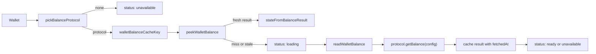
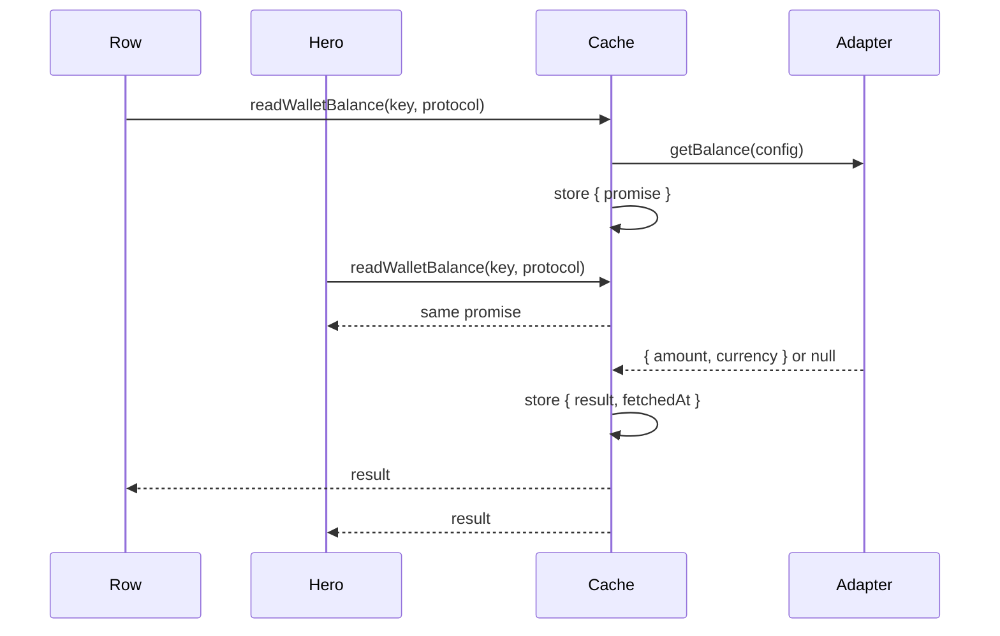
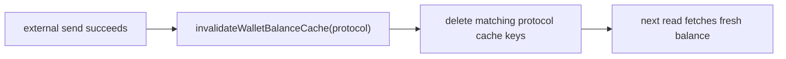

# Balance

This directory owns client-side external wallet balance reads and display helpers. It does not own wallet configuration, payment sending, or the home page layout. Its job is:

1. Pick one balance-capable send protocol for a wallet.
2. Read that protocol's balance with a small TTL cache and in-flight request sharing.
3. Return one explicit status object for row and hero UI.
4. Format the balance and source text where consumers need display strings.

## Module Map

```text
balance/
  index.js   hook and public balance API
  cache.js   TTL cache, in-flight sharing, invalidation
  format.js  display formatting and source title helpers
```

The public import is usually:

```js
import { useWalletCardBalance, invalidateWalletBalanceCache } from '@/wallets/client/components/balance'
```

Consumers that only need display helpers should import from `format.js`:

```js
import { formatWalletBalance } from '@/wallets/client/components/balance/format'
```

## High-Level Flow



The hook never sums balances across multiple protocols. A wallet can have more than one send protocol, but the UI shows one source balance: the first enabled send protocol in template order that has a `getBalance` adapter.

## Public Hook

`useWalletCardBalance(wallet)` in `index.js` returns this shape:

```js
{
  status: 'loading' | 'ready' | 'unavailable' | 'error',
  balance: { amount, currency } | null,
  error: 'temporary' | 'permanent' | null,
  sourceProtocolName: 'NWC' | 'CLN_REST' | null,
  showBalanceSlot: true | false
}
```

Concrete examples:

```js
// Fresh BTC balance from NWC
{
  status: 'ready',
  balance: { amount: 1200, currency: 'BTC' },
  error: null,
  sourceProtocolName: 'NWC',
  showBalanceSlot: true
}

// Balance-capable protocol returned no balance, such as unsupported NWC get_balance
{
  status: 'unavailable',
  balance: null,
  error: null,
  sourceProtocolName: 'NWC',
  showBalanceSlot: true
}

// No enabled send protocol supports getBalance
{
  status: 'unavailable',
  balance: null,
  error: null,
  sourceProtocolName: null,
  showBalanceSlot: true
}
```

## Protocol Selection

`pickBalanceProtocol(wallet)` lives in `index.js` because it depends on the actual client protocol registry and wallet utilities:

```text
orderedSendProtocols(wallet)
  -> first enabled send protocol in template order
  -> first one whose client protocol exports getBalance
  -> { id, name, config, getBalance }
```

This is a policy choice. The balance is not "all external wallet balances" and not "total available balance." It is the balance from one selected connection. The UI exposes that source with `balanceSourceTitle(sourceProtocolName)`, for example `balance from NWC`.

NWC balance reads first ask `get_info` and only call `get_balance` when the
connection advertises that method. NWC send connections that only support
`pay_invoice` can still send payments; their balance is treated as unavailable.

LNC balance reads check `lnc.hasPerms('lnrpc.Lightning.ChannelBalance')` before
calling `channelBalance()`. LNC sessions that only allow
`lnrpc.Lightning.SendPaymentSync` can still send payments; their balance is
treated as unavailable.

## Cache Behavior

`cache.js` stores a process-local `Map` keyed by:

```text
wallet id + protocol name + protocol id + stable config JSON
```

Entries are one of two shapes:

```js
// request in progress
{ promise }

// finished read
{ result: { balance }, fetchedAt }
```

`WALLET_BALANCE_TTL_MS` is currently 30 seconds. A fresh entry is reused by both wallet rows and the selected wallet hero. A stale entry starts a new adapter read.

## In-Flight Sharing

If a row and hero ask for the same wallet/protocol/config before the first request finishes, they share one adapter call.



The cache uses an explicit entry object to avoid an invalidated request repopulating stale data. If a send invalidates the cache while a read is still in flight, that read can still resolve for its caller, but it will not write itself back into the cache unless it is still the current entry.

## Unavailable Is Cached

A `null` or `undefined` adapter balance becomes:

```js
{ balance: null }
```

That result is cached for the same TTL as successful balances. This matters for unsupported NWC `get_balance` and LNC `ChannelBalance`: navigation should not flash loading every time the selected wallet changes and the known result is still "balance unavailable."

## Invalidation After Send

Successful external sends call `invalidateWalletBalanceCache(protocol)` from `send-submit.js`.



Invalidation matches protocol name and protocol id. It clears both finished entries and in-flight entries for that protocol identity.

## Error Classification

The hook classifies errors for display only:

- `permanent`: permission/config style errors, including `WalletPermissionsError`, `WalletValidationError`, and HTTP `401`, `403`, or `404`.
- `temporary`: timeouts, network errors, server errors, rate limits, and everything else.

Errors are not cached. A later successful read can replace the error state.

## Display Consumers

The wallet row in `home/entries.js` renders:

- `ready`: formatted balance, such as `1,200 sats`
- `loading`: `L,OAD,ING`-style placeholder
- `error`: `!`
- `unavailable`: `-`

The selected wallet hero in `home/balance.js` maps the same status into larger display states. Missing `walletBalance` defaults to unavailable, not loading. That prevents unsupported balances from flashing loading while route selection and row effects settle.

## Formatting Helpers

`format.js` owns display strings only:

- `formatWalletBalance({ amount, currency })`
  - `BTC` uses `numWithUnits(amount)`, so `1` becomes `1 sat` and larger values use the local sat formatting.
  - fiat uses `Intl.NumberFormat` and treats `amount` as minor units, such as cents.
- `formatWalletBalanceLoading()`
  - returns the loading placeholder with the locale grouping separator.
- `balanceSourceTitle(sourceProtocolName)`
  - returns `balance from NWC` or `undefined`.

Protocol adapters normalize units before the UI sees them. For BTC balances, `amount` is sats. For fiat balances, `amount` is minor units.

## Where To Change Things

- Change which protocol supplies the balance: update `pickBalanceProtocol` in `index.js`.
- Change cache TTL, keying, in-flight sharing, or invalidation: update `cache.js`.
- Change row balance rendering: update `ExternalWalletRowBalance` in `home/entries.js`.
- Change hero balance rendering: update `externalWalletBalanceDisplay` in `home/balance.js`.
- Change formatting text: update `format.js`.
- Change adapter unit conversion: update the relevant file in `wallets/client/protocols/` or shared helpers in `wallets/lib/balance.js`.

## Pitfalls

- Do not treat missing selected balance state as loading. Missing state means the parent has not heard from the row yet, not that a request is running.
- Do not cache thrown errors unless the UI also gets an explicit refresh path. Current behavior allows a later read to recover naturally.
- Do not sum multiple protocol balances without changing the product language. The current UI is one source balance.
- Do not hide protocol source details if multiple send protocols can be enabled. The `sourceProtocolName` is how consumers explain which connection supplied the value.
