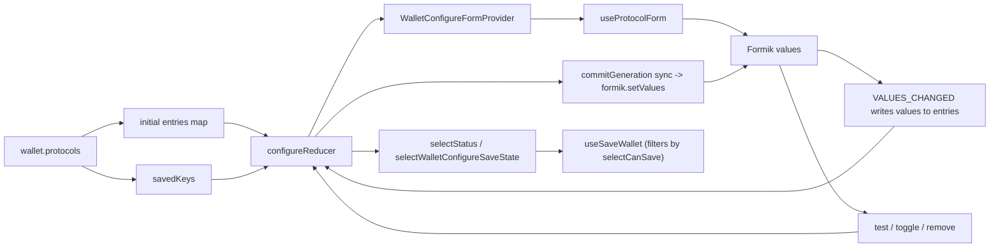
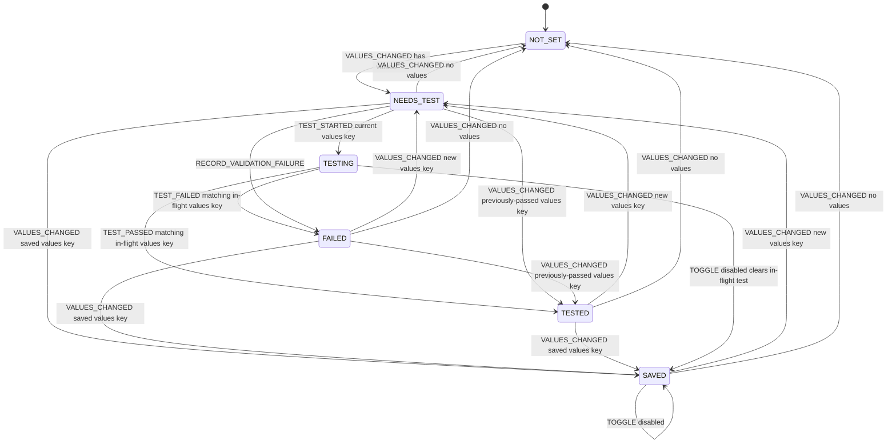
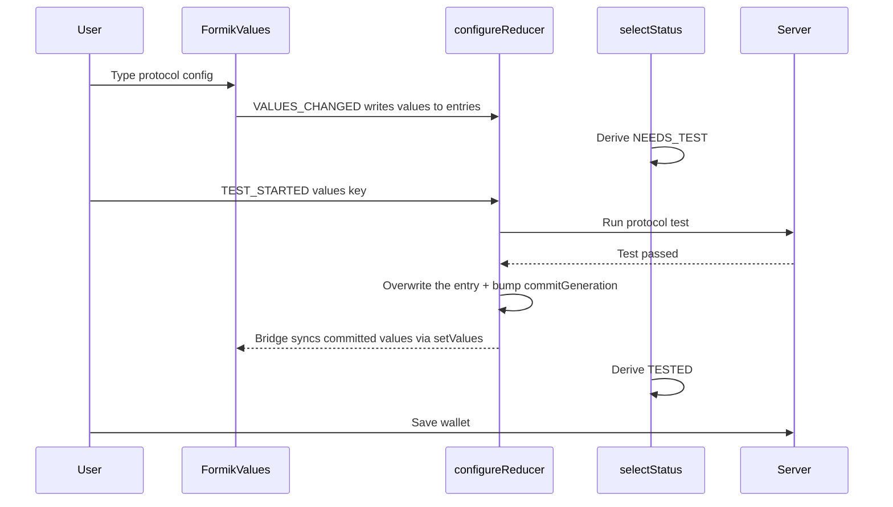

# Wallet Configure Form

This folder owns the wallet configure screen: choosing send/receive/fallback
capabilities, testing protocol configs, saving configured protocols, and removing
protocols from an existing wallet.

The important idea is that the reducer holds the live per-form values for every
protocol, and test status is derived from a handful of smaller inputs instead of
stored directly:

- `entries`: live protocol entries keyed by form id. `VALUES_CHANGED` writes through on every keystroke; commit events overwrite with the just-tested or just-toggled values.
- `testResults`: passed/failed outcomes keyed by values key.
- `savedKeys`: persisted values keys seeded from `wallet.protocols` at init.
- `inFlightTests`: the currently-running test values key per form id.
- `removedFormIds`: explicit delete tombstones for persisted protocols.
- `commitGeneration`: bumps per form id on commit events (test pass, toggle, NWC bridge) so the form bridge can push reducer-driven values back into Formik.

Formik and the reducer stay in sync via a single one-direction-per-cause bridge:
every keystroke writes Formik values through to `entries`; commit events bump
`commitGeneration` and the bridge effect calls `formik.setValues(initial)` to
push the newly-committed values back into the form. The save payload is gated
on the read side: `selectCanSave` only returns true for `SAVED` or `TESTED`
entries, so untested keystrokes never leak into the save payload even though
they live in the same map.

The provider is keyed on `wallet.id ?? wallet.name`, so a real wallet switch
(template -> persisted, or one persisted wallet to another) remounts the
provider and reseeds the reducer from scratch. Apollo refetches that return the
same wallet id/name do not remount; drafts and in-flight test state survive them.

## Module Map

| File | Owns |
| --- | --- |
| `index.js` | Page layout, save bar, and danger zone. Keys the provider on wallet identity. |
| `hooks/context.js` | Three-context split: wallet (stable), configure state (changes on every action), dispatch (stable). |
| `hooks/reducer.js` | Configure reducer, status constants, derived-status inputs, tombstones, and dev logging wrapper. |
| `hooks/protocol.js` | Pure protocol predicates, form/storage value conversion, values-key derivation, and LN_ADDR normalization. |
| `hooks/save-state.js` | `selectStatus`, `selectTestError`, `selectCanSave`, and `selectWalletConfigureSaveState`. |
| `hooks/protocol-form.js` | Protocol form initialization and shared field defaults; delegates LN_ADDR display normalization to `useLnAddrFormAdapter`. |
| `hooks/save-wallet.js` | Save persistence: upsert configured protocols and remove cleared persisted protocols. |
| `hooks/protocol-picker.js` | Send/receive shared-protocol picker state, including the NWC `lud16` -> LN_ADDR receive force. |
| `hooks/lightning-address-form.js` | React-aware LN_ADDR concerns: NWC `lud16` runtime bridge + reducer dispatch, load-time seed, and the `useLnAddrFormAdapter` (strip-on-display / append-on-submit). Pure strip/append helpers live in `wallets/lib/util.js`. |
| `hooks/tests/reducer.test.js` | Reducer and selector unit suite, including table-driven `selectStatus` contract tests. |
| `capability-card.js` | Card composition, method selection, test orchestration, and the Formik <-> reducer bridge effect. |
| `test-status.js` | Status badge display, validation helpers, and test error formatting. |
| `capability-fields.js` | Protocol field rendering, help text, paste normalization, and NWC URL change behavior. |
| `capability-test-ui.js` | Test row, enable/remove/cancel row, test button, and error UI. |

## State Flow



`WalletConfigureFormProvider` seeds `entries` and `savedKeys` from
persisted `wallet.protocols`. Persisted protocols start as `SAVED` because their
current values key matches `savedKeys`. While the user types,
`CapabilityFormikBridge` dispatches `VALUES_CHANGED` so the reducer's `entries`
map mirrors Formik values keystroke-for-keystroke. `selectStatus` reads
`entries[formId]`, computes its values key inline, and compares against
in-flight tests, saved keys, and recorded test results to derive
`NEEDS_TEST`, `TESTING`, `FAILED`, `TESTED`, or `SAVED`.

## Status Machine



This diagram is mirrored by the table-driven `selectStatus` contract tests in
`hooks/tests/reducer.test.js`.

## Save And Test Loop



The save button does not read Formik values directly. It trusts reducer state:
`useSaveWallet` walks `entries` and filters by `selectCanSave`, so only
`SAVED` or `TESTED` entries make it into the upsert payload. The gate is on the
read side, so untested keystrokes in `entries` are filtered out automatically.

Stale test results are values-key-guarded. `TEST_STARTED` records the in-flight
values key for a form id. `TEST_PASSED` and `TEST_FAILED` only apply if the
result still matches the in-flight values key. `TOGGLE`, `METHOD_SWITCHED`,
`PROTOCOL_REMOVED`, `NWC_LUD16_BRIDGE`, and `UNSAVED_FORMS_CLEARED` clear
relevant in-flight entries so late results cannot resurrect cleared or
invalidated state.

## State Glossary

`entries`

Live protocol entries keyed by `protocolFormId(protocol)`, for example
`NWC-send` or `LN_ADDR-recv`. The reducer writes through on every Formik
change, so this map always reflects the user's current values. Commit events
(test pass, toggle, NWC bridge) overwrite the entry with the just-tested or
just-toggled values. `useSaveWallet` walks this map and filters by
`selectCanSave` to build the upsert payload.

`testResults`

Passed/failed outcomes keyed by values key:

```js
new Map([
  ['{"enabled":true,"url":"nostr+walletconnect://..."}', { outcome: 'passed' }],
  ['{"enabled":true,"url":"bad"}', { outcome: 'failed', error: '...', details: '...' }]
])
```

Reverting to a previously-passed values key automatically derives `TESTED`.
Reverting to a failed values key derives `FAILED` and reuses the stored error.

`savedKeys`

Persisted values keys keyed by form id, seeded from `wallet.protocols` at init
and never rewritten during the reducer lifetime. Reverting to one of these
keys derives `SAVED`.

`inFlightTests`

The values key currently being tested for each form id. A result only applies
if its start values key matches this map. Any user action that invalidates a
pending test removes the entry.

`commitGeneration`

Per-form-id counter that bumps when the reducer commits new values
(`TEST_PASSED`, `TOGGLE`, `NWC_LUD16_BRIDGE`). `CapabilityFormikBridge` watches
this counter and calls `formik.setValues(initial)` on bump so server-enriched
or toggle-driven values flow back into the form without `enableReinitialize`'s
reset-and-wipe-touched semantics.

`removedFormIds`

Delete tombstones keyed by `protocolFormId(protocol)`. Tombstones are only added
by explicit user removal (`remove send` / `remove receive`). Method switching,
cancel, and clear-on-empty do not create tombstones. Re-introducing a real draft
for a tombstoned form id clears the tombstone.

## Concrete Flows

### New NWC Wallet

1. The template starts with an empty `entries` map and empty derived-status inputs.
2. The user opens the send card and types an NWC URL. Formik holds the values, and `CapabilityFormikBridge` dispatches `VALUES_CHANGED` on every change.
3. The reducer writes the typed values into `entries[NWC-send]`.
4. `selectStatus` derives `NEEDS_TEST` (no test result for the current values key) and save is blocked.
5. The user clicks `test`. `CapabilityProtocolForm` runs the NWC send test.
6. On success, `TEST_PASSED` overwrites `entries[NWC-send]` with the committed (possibly enriched) values, records the passing values key in `testResults`, and bumps `commitGeneration`. The bridge effect calls `formik.setValues(initial)` so any enriched fields land in Formik.
7. `selectStatus` derives `TESTED`; save is enabled.
8. `useSaveWallet` walks `entries`, filters by `selectCanSave`, and upserts the NWC protocol.

### Existing Wallet With No Changes

1. `initialConfigureState` copies persisted protocols into `entries`.
2. It also seeds `savedKeys` for persisted protocols with meaningful config.
3. `selectStatus` returns `SAVED` because current normalized values match the saved values key.
4. Save can proceed without another test because the user did not change values.

### Existing Protocol Changes

1. The user edits a field inside Formik.
2. `CapabilityFormikBridge` dispatches `VALUES_CHANGED`; the reducer writes the new values to `entries[formId]`.
3. `selectStatus` computes the new values key and returns `NEEDS_TEST` (no matching saved/passed/failed result).
4. A successful test dispatches `TEST_PASSED`, which overwrites `entries[formId]` with the committed values and records the values key as passed.
5. Reverting to the original saved value returns `SAVED`; reverting to a previously passed value returns `TESTED`.

### Switching Methods

1. The user chooses a different method in `CapabilityMethodPicker`.
2. `METHOD_SWITCHED` removes unsaved entries from `entries` for the other methods in that card.
3. Persisted sibling protocols are preserved. Method switching never tombstones or deletes a saved protocol.

### Disable Versus Remove

Disabling a persisted protocol:

1. The user toggles `enabled` off.
2. `CapabilityStateRow` dispatches `TOGGLE` with `enabled: false`.
3. `entries[formId]` keeps the entry with `enabled: false`.
4. `selectStatus` derives `SAVED` for disabled meaningful config.
5. Saving upserts the disabled state for protocols that still have config values.

Fieldless protocols (WebLN) follow a stricter invariant: tested-and-enabled or
removed. There is no useful "persisted but disabled" middle state because the
row has no config to retain. The reducer enforces this in `TOGGLE`: toggling a
persisted fieldless protocol off tombstones it so save deletes the row.
Toggling back on clears the tombstone before save.

Removing a protocol:

1. The user clicks `remove send` or `remove receive`.
2. `PROTOCOL_REMOVED` records the explicit tombstone and clears the `entries[formId]` entry.
3. Saving collects the protocol ids from `removedFormIds` and sends them in the `removeIds` array of the atomic `saveWalletProtocols` mutation.

### Removing The Last Protocol

If an existing wallet has one persisted protocol and the user removes it:

1. `removedFormIds` contains that protocol's form id.
2. The save selector sees no active configured protocols remain.
3. `selectWalletConfigureSaveState` returns `willDeleteWallet: true`.
4. The UI shows `saving will delete this wallet because no capabilities remain` and the button says `save and delete wallet`.
5. After save, the page routes to `/wallets` instead of `/wallets/:id`.

The deletion happens server-side as the last protocol is removed.

### NWC `lud16` To LN_ADDR

Some NWC URLs contain a `lud16` Lightning Address. The configure screen uses it
to help fill the receive capability.

1. The user types or pastes an NWC URL in the send card.
2. `capability-fields.js` parses the URL and calls `onNwcLud16(lud16)` when one is present.
3. `useNwcLightningAddressBridge` dispatches `NWC_LUD16_BRIDGE`, which writes an LN_ADDR receive entry into `entries` (and bumps `commitGeneration` so the receive form syncs the bridged value).
4. `selectStatus` derives `NEEDS_TEST` because the bridged values key has not passed.
5. `useWalletProtocolPicker` forces the LN_ADDR receive protocol.
6. For wallets with a known Lightning Address domain, the form displays only the local part, like `alice`, while `useLnAddrFormAdapter` in `hooks/lightning-address-form.js` appends `@example.com` via the schema transform and `capability-card`'s test path uses `applyLnAddrDomain` to append for the actual test/save call.

On page load, `useLnAddrAddressSeed` (same module as the runtime bridge) does the load-time companion: if the wallet has a saved NWC URL whose `lud16` matches the wallet's known domain, it pre-fills the LN_ADDR address field without creating an `entries` entry, so the LN_ADDR card stays in the not-configured state until the user actually opens it.

Names with `lud16` refer to the value as it appears inside an NWC URL. Once the
code is displaying, testing, or saving the receive address, it uses Lightning
Address naming instead.

## Where To Change Things

| Change | Start here |
| --- | --- |
| Save button enabled/blocked state | `selectWalletConfigureSaveState` in `hooks/save-state.js`; `index.js` renders the copy/layout. |
| Per-capability badge status | `selectStatus` in `hooks/save-state.js`. |
| Per-capability error display | `selectTestError` in `hooks/save-state.js`; `testErrorDetails` in `test-status.js` formats new errors. |
| Save persistence or protocol removal | `useSaveWallet` in `hooks/save-wallet.js`. |
| Test result, method switch, remove/cancel, tombstones, or draft pruning | `configureReducer` in `hooks/reducer.js`. |
| Protocol value conversion or values-key derivation | `hooks/protocol.js`. |
| Field rendering, paste behavior, or NWC URL change behavior | `capability-fields.js`. |
| Test button, enable toggle, remove/cancel row, or error UI | `capability-test-ui.js`. |
| NWC `lud16` to LN_ADDR bridge + LN_ADDR display normalization | `hooks/lightning-address-form.js` (`useLnAddrFormAdapter` is what `useProtocolForm` calls for strip-on-display / append-on-submit). |
| LN_ADDR local-part/domain string ops | `stripLightningAddressDomain` / `appendLightningAddressDomain` in `wallets/lib/util.js`; `applyLnAddrDomain` in `hooks/protocol.js`. |
| Protocol defaults and Formik initial values | `initialProtocolFormValues` and `useProtocolForm` in `hooks/protocol-form.js`. |

## Pitfalls

- `entries[formId]` holds untested keystrokes as well as committed values. Do not bypass `selectCanSave` when iterating for save; that selector is the integrity gate that filters out untested drafts, in-flight tests, and failed tests.
- Do not re-add `enableReinitialize` to `CapabilityProtocolForm`. Under the unified model `initial` changes on every keystroke; `enableReinitialize` would call `resetForm` and wipe touched/errors. The `CapabilityFormikBridge` sync effect plus its `commitGeneration` ref guard is the only sanctioned way to push reducer-driven values back into Formik.
- Fieldless protocols (WebLN) are tested-and-enabled or removed; toggling a persisted one off tombstones it for save-time deletion.
- Removing a protocol is deferred until save. Only explicit remove buttons add tombstones; method switching must never imply deletion of saved siblings.
- Removing the last persisted protocol deletes the wallet as a consequence of saving the removal.
- `SAVED` and `TESTED` both allow save, but they mean different things: `SAVED` is unchanged persisted/disabled state, while `TESTED` is a fresh successful test for changed/new state.
- Wallet identity must remain stable for drafts to survive. `WalletConfigureForm` keys the provider on `wallet.id ?? wallet.name`, so a different wallet remounts the provider and discards in-progress drafts. Apollo refetches that return the same wallet are safe.
