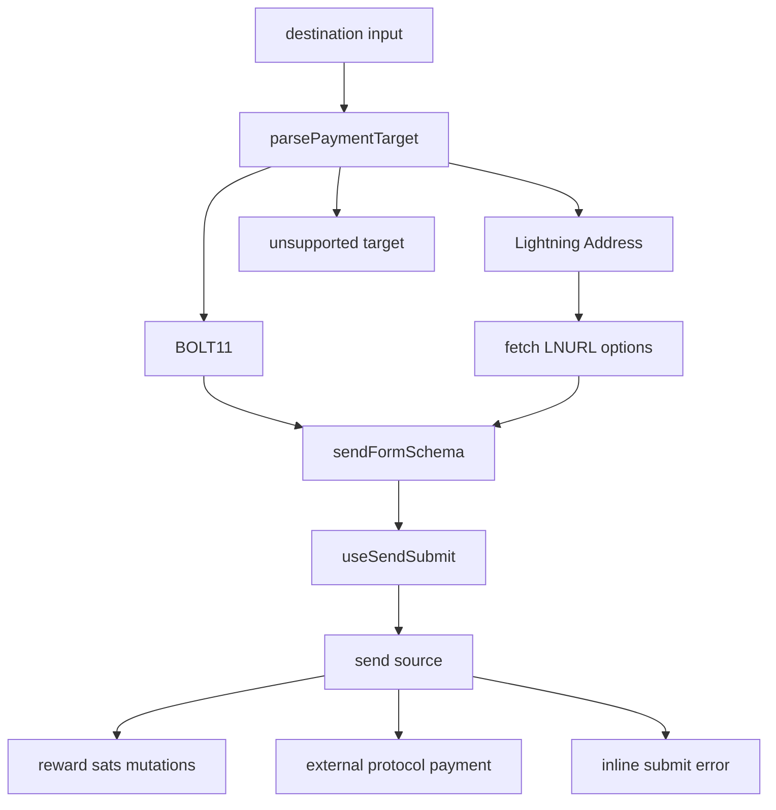
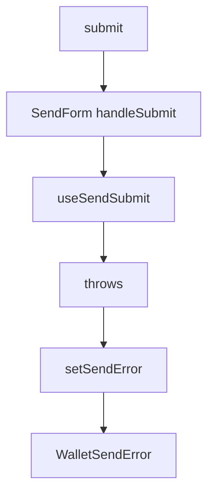

# Wallet Send

This directory owns the wallet send form for both reward sats and external wallets. It intentionally accepts two destination types in this pass:

- BOLT11 invoices
- Lightning Addresses

It does not restore the legacy WebLN "make an invoice for me" behavior from the old withdraw flow. If that behavior comes back, add it as an explicit third destination/source flow instead of folding it into BOLT11 or Lightning Address handling.

## Module Map

```text
send/
  send-form.js              form composition, field layout, success UI
  payment-target-state.js   pure destination parsing and destination enum
  payment-target.js         destination input UI and Lightning Address option loading
  schema.js                 Formik/Yup validation rules
  send-submit.js            reward-sats and external-wallet submit behavior
  reward-sats.js            reward-sats balance helpers
  amount-text.js            human-readable amount labels
  lightning-address-fields.js
  max-fee-field.js
```

## High-Level Flow



The separation is deliberate:

- Keep parsing pure in `payment-target-state.js`.
- Keep network loading in `payment-target.js`.
- Keep validation in `schema.js`.
- Keep payment side effects in `send-submit.js`.

## Destination Parsing

`parsePaymentTarget(value)` normalizes once, then classifies the target:

```js
parsePaymentTarget('lightning:lnbc...')
// { target: 'lnbc...', type: PaymentDestination.BOLT11 }

parsePaymentTarget('alice@example.com')
// { target: 'alice@example.com', type: PaymentDestination.LN_ADDR }

parsePaymentTarget('not a destination')
// { target: 'not a destination', type: null }
```

The shared enum is:

```js
export const PaymentDestination = {
  BOLT11: 'bolt11',
  LN_ADDR: 'lnaddr'
}
```

Use this parser anywhere send code needs to understand the destination. Avoid each caller re-running `normalizeBolt11PaymentRequest`, `isBolt11PaymentRequest`, and `isLightningAddress` separately.

## Destination Input

`payment-target.js` handles UI behavior around the destination field:

- Debounced typing checks.
- Enter key behavior for Lightning Address detection.
- Paste and QR scan actions.
- Replacing a detected destination.
- Stale request protection while fetching Lightning Address options.

Concrete flow for typing `alice@example.com`:

1. `onDestinationChange` debounces the raw input.
2. `loadDestinationOptions` calls `parsePaymentTarget`.
3. The parsed type is `LN_ADDR`.
4. The hook resets current LN address options to `{ min: 1 }`.
5. It fetches LNURL options with `fetchLnAddrOptions`.
6. If this is still the newest request, it stores `{ ...options, addr: target }`.
7. The form displays amount and payer-data fields from those options.

Concrete flow for pasting a BOLT11 invoice:

1. `DestinationActions` reads the clipboard.
2. `parsePaymentTarget` validates it as supported.
3. The normalized target is written into Formik.
4. `loadDestinationOptions` marks the destination as `BOLT11`.
5. The field collapses into the detected destination row.

## Validation

`schema.js` owns the full send form schema. `SendForm` passes in only the changing inputs:

```js
sendFormSchema({
  rewardSats,
  supportsMaxFee,
  destinationType,
  loadingLnAddrOptions,
  lnAddrOptions,
  availableSats
})
```

Important validation rules:

- BOLT11 invoices must specify an amount.
- Lightning Addresses must finish option loading before submit.
- Lightning Address amounts must satisfy `min` and `max` from LNURL options.
- Reward sats sends must fit within `availableSats - maxFee`.
- `maxFee` is required only when the source/protocol supports max fee.
- Mandatory payer data from LNURL options is required.

Concrete reward-sats BOLT11 balance check:

```text
availableSats = 1000
maxFee = 10
invoice amount = 990 sats

990 <= 1000 - 10
valid
```

Concrete Lightning Address min/max check:

```text
lnAddrOptions.min = 10
lnAddrOptions.max = 5000
amount = 5

invalid: must be at least 10
```

## Submit Sources

`send-submit.js` splits behavior into two source helpers.

Reward sats source:

- BOLT11: calls `createWithdrawl`, then routes to `/transactions/<id>`.
- Lightning Address: calls `sendToLnAddr`, then routes to `/transactions/<id>`.

External wallet source:

- BOLT11: pays the invoice through the selected wallet protocol.
- Lightning Address: fetches a BOLT11 invoice with `fetchLnAddrInvoice`, then pays it through the selected wallet protocol.
- On success: updates the local sent success screen and invalidates the external wallet balance cache.

Wallet-shell external sends pass `WALLET_SHELL_SEND_PAYMENT_TIMEOUT_MS` to
`sendWalletPayment`. This keeps the direct send form responsive without changing
the longer shared wallet timeout used by pay-in/zap flows.

Concrete external Lightning Address flow:

1. User enters `alice@example.com`.
2. LNURL options are fetched.
3. User enters amount and payer data.
4. Submit calls `fetchLnAddrInvoice`.
5. The returned `pr` is sent through `sendWalletPayment`.
6. `invalidateWalletBalanceCache(protocol)` clears the source balance cache.
7. The form shows the sent success state.

## Submit Errors

Submit failures are caught by `SendForm` and rendered inline near the send footer. They do not bubble to the shared `Form` error handler, so wallet send failures should not appear as global toasts.



Concrete external payment failure:

1. `sendExternalPayment` calls the selected protocol.
2. The protocol throws, or returns an invalid payment result through `sendWalletPayment`.
3. `sendExternalPayment` writes `payment failed: ...` to wallet logs and rethrows.
4. `SendForm` catches the error.
5. `WalletSendError` renders `payment failed` and the error message inline.
6. Retrying submit clears the old error before the next attempt.

Concrete reward-sats mutation failure:

1. `createWithdrawl` or `sendToLnAddr` throws.
2. `SendForm` catches the error.
3. The inline error appears in the form instead of a toast.
4. No redirect happens unless the mutation succeeds.

Display paths are intentionally separate:

- Field validation errors are still field-level Formik/Yup errors from `schema.js`.
- Paste and QR helper errors still use immediate helper feedback in `payment-target.js`.
- Submit errors use `WalletSendError` in `send-form.js`.

## Reward Sats Helpers

`reward-sats.js` keeps reward-sats math shared:

```js
availableRewardSats(me)
// max(privates.sats - privates.credits, 0)

availableRewardSatsAfterFee(availableSats, maxFee)
// availableSats - Number(maxFee || 0)
```

The reward-sats send page uses `availableRewardSats` for display. `schema.js` uses `availableRewardSatsAfterFee` for validation. This keeps the page and schema from drifting.

## UI Composition

`send-form.js` should stay mostly declarative:

- Get target options from `usePaymentTargetOptions`.
- Build the schema with `sendFormSchema`.
- Render `DestinationInput`.
- Render either `LightningAddressFields` or BOLT11 info/max-fee fields.
- Delegate submit behavior to `useSendSubmit`.

It should not grow new parsing, schema, or payment branches. Put those in the modules above.

## Where To Change Things

- Add a new destination type: start in `payment-target-state.js`, then update `payment-target.js`, `schema.js`, and `send-submit.js`.
- Change Lightning Address option loading: update `payment-target.js`.
- Change validation: update `schema.js`.
- Change reward-sats available balance math: update `reward-sats.js`.
- Change what happens during payment submit: update `send-submit.js`.
- Change submit error display: update `WalletSendError` in `send-form.js`.
- Change field layout or success UI: update `send-form.js`.

## Pitfalls

- Do not reintroduce destination parsing in multiple places. Use `parsePaymentTarget`.
- Do not perform network requests from `payment-target-state.js`; it must stay pure.
- Do not cache LNURL options without accounting for the typed address. Current behavior stores `addr` with the options and validates against it.
- Do not let reward-sats display math and validation math drift.
- Do not fold future WebLN behavior into BOLT11 or Lightning Address branches. Add a distinct destination/source path.
- Do not rethrow submit errors from `SendForm` after setting `sendError`, or the shared form toast will return.
